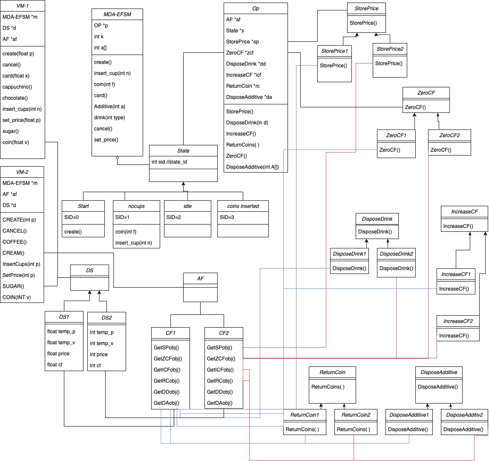

# CS586Project — Software System Architecture Final Project

A Java simulation of two vending machines that demonstrates three classic Gang of Four design patterns: **State**, **Strategy**, and **Abstract Factory**.



---

## Overview

The system models a hot-drink vending machine in two variants (VM-1 and VM-2). Both machines share the same finite-state machine core (`MDAEFSM`) but differ in their data types and available drinks/additives. The design is intentionally pattern-heavy to showcase how architectural patterns decouple behavior from structure.

---

## Design Patterns Used

### 1. State Pattern
The machine's lifecycle is modeled as four explicit states:

| State ID | Class | Description |
|----------|-------|-------------|
| 0 | `Start` | Machine just powered on; awaiting `create()` |
| 1 | `nocups` | Initialized but no cups loaded |
| 2 | `idle` | Cups available; waiting for payment |
| 3 | `coininserted` | Sufficient funds received; ready to dispense |

The abstract `State` class defines all possible operations. Each concrete state only overrides the operations valid for that state — all others print an "operation not available" message. The `MDAEFSM` class owns a `State[]` array and delegates every operation to `currentState`, then handles transitions.

### 2. Strategy Pattern
All vending operations are encapsulated as strategy interfaces, allowing each VM variant to plug in its own implementation:

| Interface | Purpose |
|-----------|---------|
| `StorePrice` | Persist a new drink price |
| `IncreaseCF` | Add inserted coin value to cumulative fund |
| `ZeroCF` | Reset the cumulative fund to zero |
| `ReturnCoin` | Return coins to the customer |
| `DisposeDrink` | Dispense the selected drink |
| `DisposeAdditive` | Dispense selected additives (sugar, cream, etc.) |

Each interface has two concrete implementations — one for VM-1 (suffix `1`) and one for VM-2 (suffix `2`). The `Op<T>` class acts as a strategy container, holding references to all active strategies and forwarding calls from state objects.

The `DS<T extends Number>` class is the generic data store shared across strategies. VM-1 uses `DS1` (Float-based), VM-2 uses `DS2` (Integer-based).

### 3. Abstract Factory Pattern
The `AF` interface is the abstract factory. It declares factory methods for every strategy object a machine needs. Two concrete factories implement it:

- **`CF1`** — creates all VM-1 strategy objects (Float-based)
- **`CF2`** — creates all VM-2 strategy objects (Integer-based)

`VM1` and `VM2` each call their respective factory at startup to assemble the full `Op<T>` bundle, then wire it into `MDAEFSM`. This means adding a third vending machine variant only requires a new `AF` implementation and a new `DS` subclass — no changes to the state machine or states.

---

## Vending Machine Variants

### VM-1
- Payment in **float** (dollars/cents); supports coin and card
- Drinks: `cappuccino`, `chocolate`
- Additives: `sugar`

### VM-2
- Payment in **integer** (cents); coin only, no card
- Drinks: `coffee`
- Additives: `sugar`, `cream`

---

## State Machine Transitions

```
Start ──create()──► nocups ──insert_cups()──► idle ──coin(sufficient)/card()──► coininserted
                      ▲                        │  ◄──cancel()──────────────────────┘
                      └────────────────────────┘  (last cup dispensed → back to nocups)
```

---

## How to Run

**Using the pre-built JAR:**
```bash
java -jar CS586Project.jar
```

**From source** (requires Java 8+, compile all `.java` files in `sourcecode/`):
```bash
cd sourcecode
javac *.java
java Driver
```

Follow the on-screen menu to select a vending machine and invoke operations interactively.

---

## Project Structure

```
sourcecode/
├── Driver.java          # Entry point; interactive CLI menu
├── MDAEFSM.java         # Model-Driven Adaptive EFSM — the state machine core
├── State.java           # Abstract State base class
├── Start.java           # State 0: initial state
├── nocups.java          # State 1: no cups loaded
├── idle.java            # State 2: awaiting payment
├── coininserted.java    # State 3: funds received
├── AF.java              # Abstract Factory interface
├── CF1.java             # Concrete Factory for VM-1
├── CF2.java             # Concrete Factory for VM-2
├── DS.java              # Generic data store (Strategy)
├── DS1.java             # Float data store for VM-1
├── DS2.java             # Integer data store for VM-2
├── Op.java              # Strategy container passed to states
├── VM1.java             # VM-1 facade
├── VM2.java             # VM-2 facade
├── Data.java            # Runtime data (cup count, additive array)
├── StorePrice.java / StorePrice1.java / StorePrice2.java
├── IncreaseCF.java / IncreaseCF1.java / IncreaseCF2.java
├── ZeroCF.java / ZeroCF1.java / ZeroCF2.java
├── ReturnCoin.java / ReturnCoin1.java / ReturnCoin2.java
├── DisposeDrink.java / DisposeDrink1.java / DisposeDrink2.java
└── DisposeAdditive.java / DisposeAdditive1.java / DisposeAdditive2.java
```

---

## Course

CS 586 — Software System Architecture, Illinois Institute of Technology, Spring 2025
